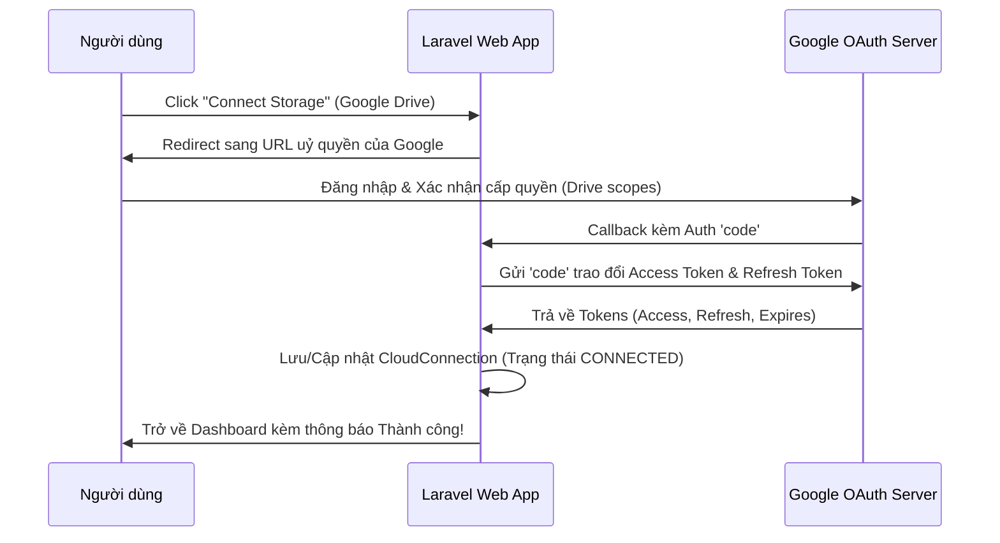

# Kế hoạch thiết kế: Tích hợp Google Drive OAuth & Flysystem Storage

Mục tiêu: Cài đặt gói mở rộng Google Drive Flysystem, xây dựng luồng xác thực OAuth2 với Google để cấp quyền và tự động tạo/lưu trữ `CloudConnection` cho người dùng.

---

## Luồng Xác thực Google OAuth2 chi tiết



### Các quyền (Scopes) yêu cầu uỷ quyền từ Google:
Để hỗ trợ việc đọc, tải lên và quản lý tệp tin, chúng ta sẽ xin scope:
*   `https://www.googleapis.com/auth/drive` (Toàn quyền quản lý tệp trong Drive của người dùng)

---

## Cấu hình & Tích hợp

### 1. Dependencies & Configuration
- Gói: `masbug/flysystem-google-drive-ext`
- Services config:
```php
'google' => [
    'client_id' => env('GOOGLE_CLIENT_ID'),
    'client_secret' => env('GOOGLE_CLIENT_SECRET'),
    'redirect_uri' => env('GOOGLE_REDIRECT_URI'),
],
```

### 2. Routes & Controller
- URL Redirect: `/oauth/google/redirect` -> `CloudConnectionController@redirectToGoogle`
- URL Callback: `/oauth/google/callback` -> `CloudConnectionController@handleGoogleCallback`

### 3. Flysystem Storage Driver Registration
- Storage extend dynamically in `CloudStorageServiceProvider` (`bootstrap/providers.php`).
